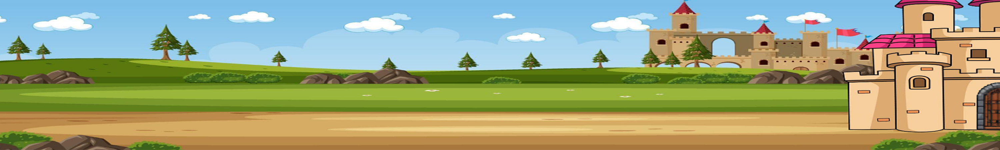
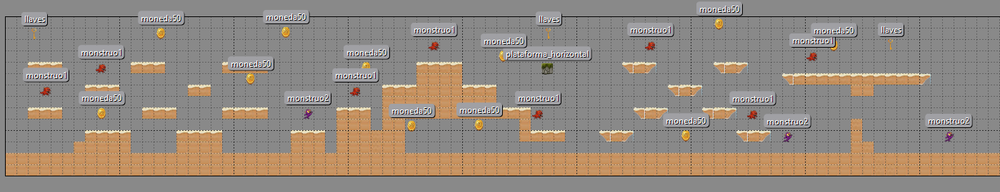
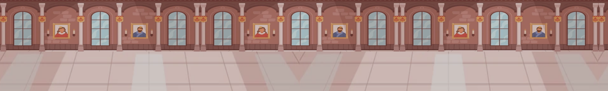
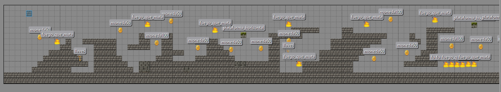
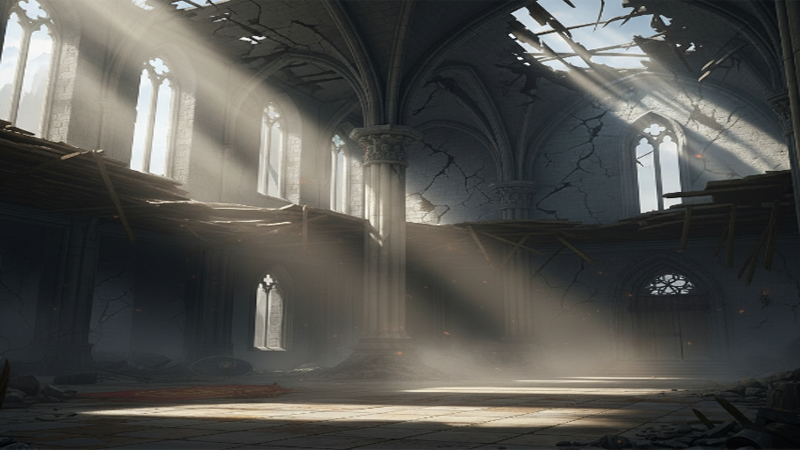
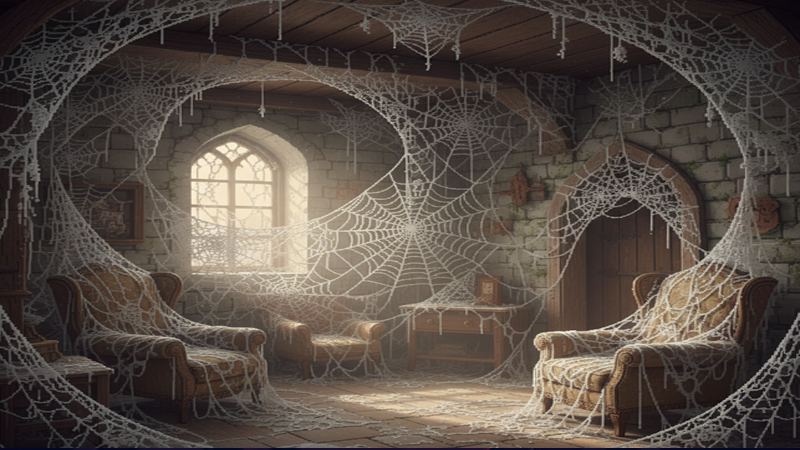
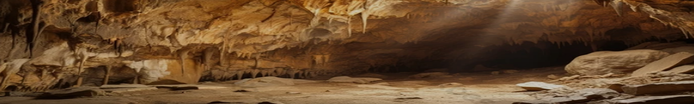
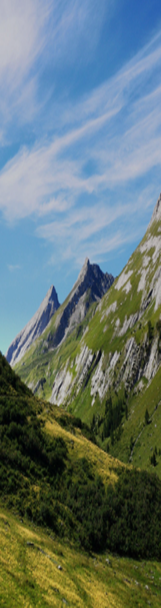
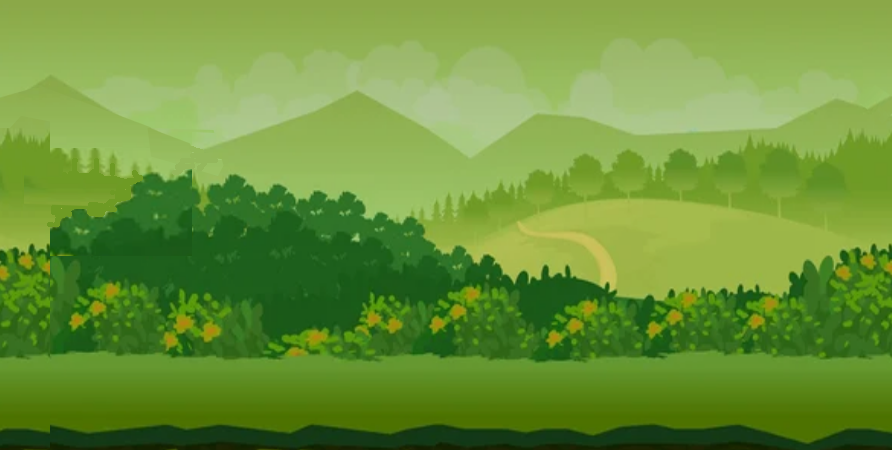

# Development

## Ojbects

* Uso de la herencia para crear enemigos X
* Uso de las máquinas de estado X
* Uso de los mapas de tiles X
* Uso del pool de instancias

# Tileset

# Levels

## Level 1 - El reino escorpión

* Fondo: La pantalla de los montes con el castillo al fondo.
* Tiles: Ladrillos marrones y verdes.
* Enemigos: Buitres que te persiguen y escorpiones.

## Level 2

* Fondo: El interior del castillo.
* Tiles: Marrones y blancos.
* Enemigos: Monstruos que lanzan fuego en horizontal y vertical.

## Level 3

* Fondo castillo oscuro verde
* Tiles: Ladrillos grises
* Eenemigos aves que siempre salen por la derecha y fuegos que matan

## Level 4, el enermigo escorpión

* Se mueve hacia tu posición y si está cerca te clava el aguijón.

## Level 5, el reino bomba

* Fondo: Catillo interior de fondo lila
* Tiles: Ladrillos grises.
* Enemigos: bolques que aplastan, sierras, bolas de fuego.

## Level 6

* Fondo: El bosque de la madera
* Tiles: listones marrones.
* Enemigos: Pájaros que salen por la derecha.

## Level 7

* Fondo: dentro de la cueva
* Tiles: Piedras grises y oscuras, bloques marrones claros.
* Enemigos: Sierras, fuego que quema, lava

## Level 8, el águila

* Fondo: Balcón de marmol
* Tiles: Ladrillos grises claros.

## Level 9

* Fondo: Palacio interior, color violeta
* Tiles: marrones claros, azul claro
* Enemigos: Péndulos, bombas, bloques que aplastan

## Level 10

* Fondo: El bosque del dragón
* Tiles: Marrones claros con cesped por encima
* Enemigos: Dragón que te persigue y escupe fuego, murciélagos, arañas

## Level 11

* Fondo: Pasillo palacio interior
* Tiles: Grises claros
* Enemigos: Hombre del martillo, calavera grande y penqueña, sierra

## Level 12, el dragón de fuego

* Fondo: 
* Tiles: 

## Level 13, la sombra

* Fondo: 
* Tiles: 

## Level 14, vetical

* Fondo: 
* Tiles: 

## Level 15, a correr

* Fondo: 
* Tiles: 

## Level 16, la batalla final

* Fondo: 
* Tiles: 

