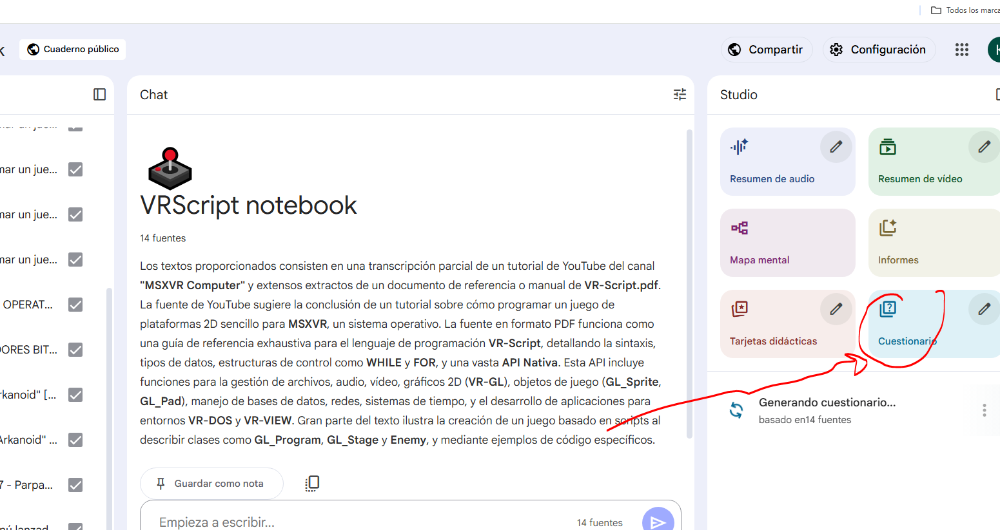

# VRScript games

## El caballero de la vara

<a href="https://github.com/kikemadrigal/VRScript-projects/tree/main/El%20tio%20de%20la%20vara">Haz click aquí para ver sus datos</a>

## Helicopter

Testeo de movimiento de cámara en un fondo de 4000 px.

## Lili the Cat

Ejemplo básico de creación de un juego, son 2 proyectos, uno sencillo y otro avanzado.

En el avanzado se hereda de la clase app que tiene los arrays de los enemigos, el player, la música, etc, también se crea un botón con su evento onclick.

# Entorno de desarrollo

1. Instala samba
   
   Abre OpenBox en tu MSXVR

   

   Abre el terminal

    

    Instala samba con "sudo apt install samba"

    

    Dirígete al directorio /etc/samba y abre el archivo smb.conf con nano:

    

    Dentro del archivo smb.conf baja hasta abajo y agrega la siguiente linea:

    [global]

    netbios name= MSXVR

    server string= The MSXVR file center

    workgroup = WORKGROUP

    [MSXVR]

    path =/mnt/usb_1

    comment = No comment

    browsable = yes

    writeable = yes

    create mask = 0777

    directory mask = 0777

    public = no

    

    Crea un nuevo usuario para samba con "sudo smbpasswd -a msxvr" y ponle la contraseña msxvr:

    

    Reinica el MSXVR de un botonazo.

    Una vez reiniciado escribe en el terminal de openbox "ifconfig" para ver la dirección ip, también es posible ver la dirección ip esbiendo en el terminal "hostname -I":

    

    Vamos a windows y en el explorador de archivos ponemos la ip del MSXVR, en mi caso escribo en la barra de direcciones \\192.168.1.19:

   

    Ya podemos abrir el vscode.

    # Programado con Inteligencia artificial

    ## Vscode + complementos IA

    Aunque lo suyo es trabajar con github copilot, a mi me gusta windsurf o cursor ya que no necesitan unua cuenta de github:

    

    

    ## Google NotebookLM

    Accede a <a href="https://notebooklm.google.com/">https://notebooklm.google.com/</a>

    Registrate con tu cuenta de google y crea un nuevo cuaderno:

    

    Ve añadiendo vídeos de VRScript:

    

    Haz el cuestionario para ver lo que sabes:

    

    Si quieres, puedes hacerle alguna pregunta con mi cuaderno:

    <a href="https://notebooklm.google.com/notebook/8bd20ba3-c1b3-4b95-82a2-b2dc479e4502" target="_blanck">VR script notebooklm<a>

    